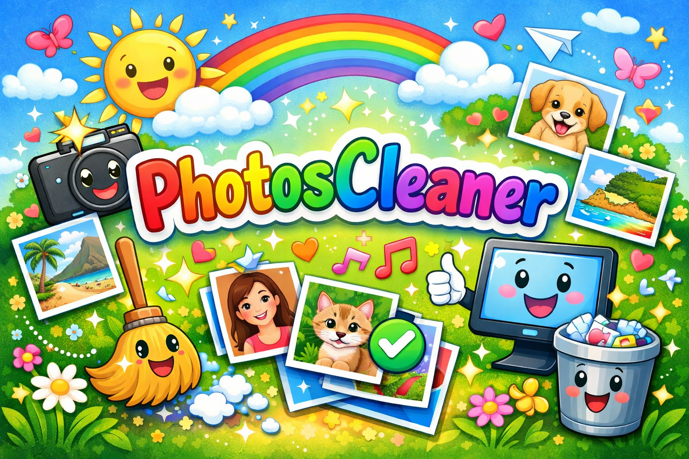

# PhotosCleaner



A native macOS app that scans your Apple Photos library **and any folder on your Mac** — including network drives — to find screenshots, web-saved images, duplicates, and other non-photo clutter. Reclaim space and keep your library clean.

Built with SwiftUI and PhotoKit. No cloud services, no subscriptions, no data leaves your Mac.

## What It Does

PhotosCleaner runs a six-phase analysis of your Photos library and/or a selected folder:

1. **Folder enumeration** — recursively scans a folder for image files (JPEG, PNG, HEIC, TIFF, RAW, etc.)
2. **Basic classification** — flags screenshots, tiny images, and unusual aspect ratios
3. **EXIF metadata extraction** — reads camera make/model, lens, GPS coordinates, and timestamps directly from image files
4. **Source classification** — determines whether each photo came from a camera, was saved from the web, is a screenshot, panorama, Live Photo, HDR, or depth-effect image
5. **Perceptual fingerprinting** — generates visual fingerprints using Apple's Vision framework (`VNFeaturePrintObservation`)
6. **Duplicate detection** — compares fingerprints to find visually similar or duplicate photos, even across your Photos library and folder

Results are presented in a tabbed dashboard with four views:

- **Overview** — summary stats and flagged items breakdown, with source breakdown (Photos Library vs. Folder)
- **Categories** — every photo categorized (camera, web, screenshot, duplicate, panorama, etc.) with visual percentage bars
- **Duplicates** — grouped duplicate sets with a dedicated side-by-side review interface
- **Sources** — source classification breakdown, top camera models from EXIF, and GPS location grouping

## Screenshots

*Coming soon*

## Features

- **Dual-source scanning** — scan your Photos library, a folder (local or network), or both at once
- **Adaptive performance** — automatically tunes concurrency to your hardware (CPU cores, RAM)
- **Thumbnail caching** — in-memory cache for fast review of network/folder photos
- **Stop Scan** — cancel a deep scan at any time and keep partial results from completed phases
- **Item-by-item review** with Delete / Keep / Move actions and batched deletion
- **Duplicate review** with side-by-side comparison — automatically identifies the highest-resolution "best" copy
- **Cross-source duplicates** — finds duplicates between your Photos library and folder photos
- **Quick Scan mode** skips fingerprinting for a faster scan (~2–5 min vs. 15–30 min for 4,000 photos)
- **GPS location grouping** with reverse geocoding (clusters nearby coordinates, geocodes up to 50 unique locations)
- **CSV export** of the full library analysis with all metadata columns including photo source
- **Review album creation** in Photos for flagged items
- **Speed Mode** for rapid triage of large libraries

## Requirements

- macOS 13.0 (Ventura) or later
- Xcode 15+ to build from source
- Photos library access (prompted on first launch)

## Building

1. Clone the repo
2. Open `PhotosCleaner.xcodeproj` in Xcode
3. Build and run (⌘R)

No external dependencies — the app uses only Apple frameworks: Photos, Vision, CoreLocation, ImageIO, and SwiftUI.

To archive for standalone use: Product → Archive → Distribute App → Copy App.

## Project Structure

```
PhotosCleaner/
├── PhotosCleanerApp.swift      # App entry point
├── ContentView.swift           # Main UI with tabbed results dashboard + folder picker
├── ScanViewModel.swift         # Six-phase dual-source scan pipeline and state management
├── PhotoItem.swift             # Data model (PhotoItem, PhotoSource, EXIFData, DuplicateGroup, enums)
├── EXIFExtractor.swift         # EXIF metadata reading and source classification (PhotoKit + filesystem)
├── DuplicateDetector.swift     # Vision framework fingerprinting and duplicate grouping (PhotoKit + filesystem)
├── CategoryAnalyzer.swift      # Metadata-based content categorization
├── FileSystemScanner.swift     # Recursive folder image enumeration and basic classification
├── ThumbnailCache.swift        # NSCache-based in-memory thumbnail cache for folder photos
├── HardwareAdaptor.swift       # Adaptive concurrency based on CPU cores and RAM
├── ReviewView.swift            # Item-by-item review interface (dual image loading)
├── DuplicateReviewView.swift   # Side-by-side duplicate review interface (dual image loading)
├── PhotosCleaner.entitlements  # Hardened Runtime entitlements for Photos access
├── Credits.rtf                 # About window credits
└── Assets.xcassets/            # App icon (skeuomorphic style, all 10 macOS sizes)
```

## How It Works

PhotosCleaner uses only metadata and perceptual hashing — there is no machine learning or cloud API involved.

- **Filesystem scanning** uses `FileManager.enumerator` to recursively find image files, and reads pixel dimensions via `CGImageSource` without decoding the full image.
- **EXIF analysis** reads image properties via `CGImageSourceCopyPropertiesAtIndex` without decoding pixels, so it's fast and memory-efficient. Works identically for Photos library and folder photos.
- **Source classification** checks `PHAsset.mediaSubtypes` (screenshot, panorama, HDR, Live Photo, depth effect) for Photos library items, and falls back to filename heuristics + EXIF Make/Model for folder photos.
- **Duplicate detection** uses Apple's `VNGenerateImageFeaturePrintRequest` to produce a perceptual fingerprint for each photo from both sources, then does pairwise comparison with `computeDistance(to:)`. Photos within a configurable threshold (default: 0.5) are grouped as duplicates — even across Photos library and folder sources.
- **Thumbnail caching** uses `NSCache` with a 200 MB limit to keep thumbnails in memory for fast review of network photos without re-reading from the network drive.
- **Adaptive performance** reads `ProcessInfo.processInfo.activeProcessorCount` at runtime to scale concurrency (e.g., M1 Max with 10 cores gets 5 concurrent EXIF reads, 3 concurrent fingerprints).
- **Batch deletions** for Photos library items queue photos during review and execute them in a single `PHPhotoLibrary.performChanges` call. Folder photos are moved to Trash via `NSWorkspace.shared.recycle`.

## Privacy

Everything runs locally on your Mac. PhotosCleaner does not connect to any server, collect analytics, or transmit any data. GPS reverse geocoding uses Apple's `CLGeocoder`, which is an on-device/Apple-only service.

## Authors

Developed by **Claude Opus 4.6** and **Richard Henderson**.

## License

Copyright (C) 2026 Richard Henderson

This program is free software: you can redistribute it and/or modify it under
the terms of the **GNU General Public License v3.0** as published by the Free
Software Foundation, either version 3 of the License, or (at your option) any
later version.

This program is distributed in the hope that it will be useful, but WITHOUT ANY
WARRANTY; without even the implied warranty of MERCHANTABILITY or FITNESS FOR A
PARTICULAR PURPOSE. See the [GNU General Public License](https://www.gnu.org/licenses/gpl-3.0.html)
for more details.

See the [LICENSE](LICENSE) file for the full license text.
